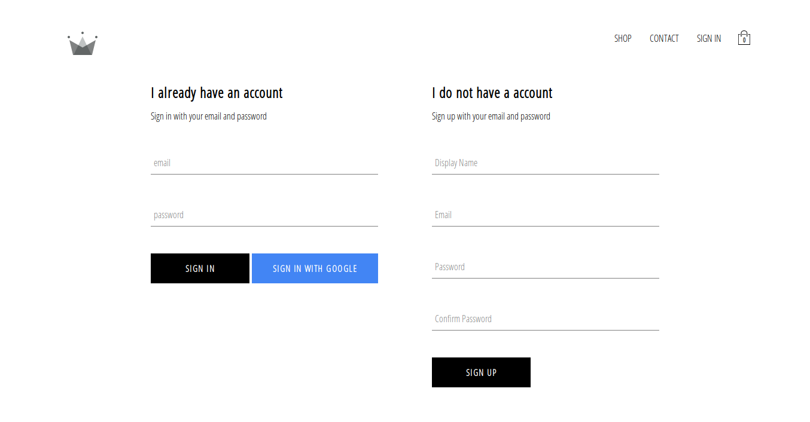

# Pasar Malam (Ecommerce Website)

&nbsp;
## About
see [Wikipedia](https://en.wikipedia.org/wiki/Pasar_malam)
> It is an Indonesian and Malay word that literally means "night market" (the word comes from bazaar in Persian). A pasar malam is a street market in Indonesia, Malaysia, Brunei and Singapore that opens in the evening, usually in residential neighbourhoods.

Front-end developed using React & Redux. User authentication details stored in Firebase Auth. Payment system done using Stripe. Deployed using Netlify/Heroku.

Emails and passwords are handled by Google's Firebase. All authentication information are stored in Google's servers.

<!-- &nbsp;
## To Dos
- ... -->

&nbsp;
## Pages
### Homepage

&nbsp;
### Login/Sign Up

&nbsp;
### Categories

&nbsp;
### Specific Category

&nbsp;
### Checkout

&nbsp;
### Stripe Payment

&nbsp;
## Acknowledgments
- [Andrei Neagoie & Yihua Zhang](https://www.udemy.com/complete-react-developer-zero-to-mastery/)